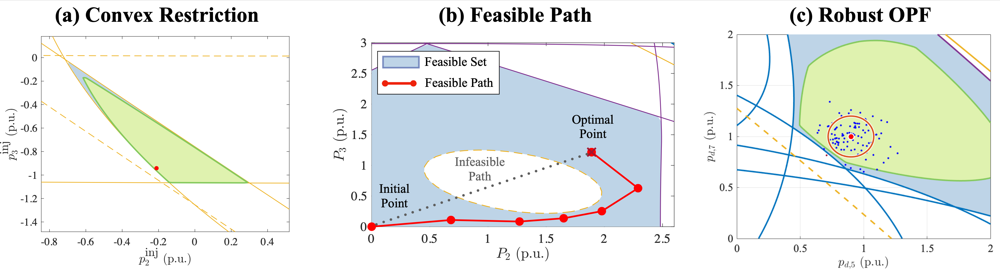

# Optimal Power Flow with Convex Restriction

This repository provides implementation code for Convex Restriction of AC Optimal Power Flow problem. Please see citations for more details.



You can also find other applications of convex restriction in my [project page](https://dclee131.github.io/research/2019/10/07/CVXRS.html).

### Installation Requirements

The script has written in Julia v1.1, and can be run without installation.
Follwing packages are necessary to run the code.

```julia
using JuMP, PowerModels, Ipopt, MosekTools, Gurobi, SparseArrays, LinearAlgebra, Plots
```

## Quick Start


```julia
## Import PowerFlowCVXRS functions
include("../src/main.jl")

## Read network data using PowerModels.jl
network_data = PowerModels.parse_file("../../pglib-opf-master/pglib_opf_case118_ieee.m");

## Initiailize the network data by solving OPF problem
network_data=opf_initialization(network_data)

## Run Sequential Convex Restriction with 5 iterations
network_data, result_cvxr = scrs(network_data, 5);
```

You can check the folder `tutorials` to find more examples.

## Citation

If you find this content useful for your research, please consider citing: 

[1] Convex Restriction of Power Flow Feasibility Set <br />
TL;DR: proposes convex restriction of OPF constraints.

    @article{lee2019convex,
      author={Lee, Dongchan and Nguyen, Hung D. and Dvijotham, K. and Turitsyn, Konstantin},
      journal={IEEE Transactions on Control of Network Systems},
      title={Convex Restriction of Power Flow Feasibility Sets},
      year={2019}, volume={6}, number={3}, pages={1235-1245}, month={Sep.}
    }

[2] Feasible Path Identification in Optimal Power Flow with Sequential Convex Restriction <br />
TL;DR: uses convex restriction sequentially to identify a feasible path.

    @article{lee2019feasible,
      title={Feasible Path Identification in Optimal Power Flow with Sequential Convex Restriction},
      author={Lee, Dongchan and Turitsyn, Konstantin and Molzahn, Daniel K and Roald, Line A},
      journal={arXiv preprint arXiv:1906.09483},
      year={2019}
    }

[3] Robust Optimal Power Flow with Convex Restriction  <br />
TL;DR: convex restriction provides a tractable way to solve robust OPF problem.

